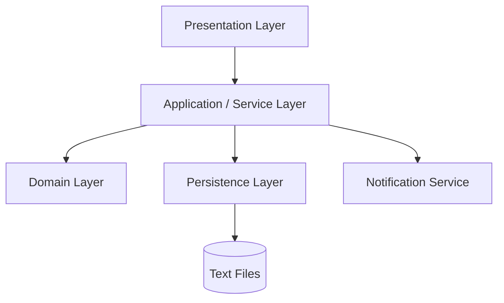

# Vehicle Rental Management System

A console-based Vehicle Rental Management System developed as a Java software engineering course project. The system allows an authenticated manager to view available vehicles, create rentals, prevent double booking, enforce rental policies, send expiry notifications, process vehicle returns, and calculate rental costs.

The implementation follows the original **Vehicle Rental Management System (Phase 1 + 2)** specification and uses a layered architecture, automated testing, mocking, code coverage, design patterns, and file-based persistence.

## Project Objectives

The project demonstrates:

- Object-oriented programming and polymorphism.
- Layered software architecture.
- Strategy and Observer design patterns.
- Repository abstractions and persistence.
- Unit testing with JUnit 5.
- Mocking with Mockito.
- Code coverage with JaCoCo.
- Documentation with Javadoc.
- Version control and collaborative development with Git and GitHub.

## Implemented User Stories

### Sprint 1 — Authentication and Vehicle Catalog

- Manager login using stored credentials.
- Invalid login attempts return an error message.
- Manager logout.
- Protected operations require authentication.
- Display available vehicles only.
- Hide rented or unavailable vehicles.

### Sprint 2 — Rental Operations

- Create a rental record.
- Change the selected vehicle status to `RENTED`.
- Reject duplicate rental IDs.
- Prevent multiple active rentals for the same vehicle.
- Validate rental dates and rental duration.
- Limit the rental period to a maximum of 30 days.

### Sprint 3 — Notifications and Mocking

- Send a rental confirmation email.
- Generate rental expiry reminders.
- Send reminders two days before expiry and on the expiry date.
- Use a mock `NotificationService` during automated tests.

### Sprint 4 — Returns and Billing

- Return a rented vehicle.
- Change the vehicle status back to `AVAILABLE`.
- Close the active rental record.
- Calculate the rental cost using a pricing strategy.
- Add a late-return penalty when applicable.

### Sprint 5 — Vehicle Types and Polymorphism

The system supports:

- Car
- Motorcycle
- Van
- Truck
- Electric Vehicle

Each vehicle type can apply its own rental validation rules.

## Vehicle-Specific Rules

| Vehicle type | Rule |
|---|---|
| `CAR` | Uses the default rental validation rules |
| `VAN` | Uses the default rental validation rules |
| `MOTORCYCLE` | Customer must be at least 21 years old |
| `TRUCK` | Customer must have a special truck license |
| `ELECTRIC_VEHICLE` | Battery must be checked before rental |

## Technologies

- Java 17
- Apache Maven
- JUnit 5
- Mockito
- JaCoCo
- Jakarta Mail
- Java Dotenv
- Git and GitHub

The assignment permits Java 8 or later. This implementation is configured for Java 17 in `pom.xml`.

## Architecture

The project uses four main layers:



### Presentation Layer

Responsible for console input, output, and user interaction.

- `Main`
- `ManagerLoginController`
- `VehicleCatalogController`
- `RentalController`

### Application Layer

Coordinates application use cases and business workflows.

- `AuthService`
- `VehicleCatalogService`
- `RentalService`
- `RentalReminderService`
- `NotificationService`
- `EmailNotificationService`
- `DateProvider`
- `SystemDateProvider`

### Domain Layer

Contains entities, enums, and business strategies.

- `Manager`
- `Rental`
- `Vehicle`
- `Car`
- `Motorcycle`
- `Van`
- `Truck`
- `ElectricVehicle`
- `RentalCostStrategy`
- `StandardStrategy`
- `RentalValidationStrategy`
- Vehicle-specific validation strategies
- `VehicleStatus`
- `VehicleType`
- `RentalStatus`

### Persistence Layer

Defines repository interfaces and file-based implementations.

- `ManagerRepository`
- `VehicleRepository`
- `RentalRepository`
- `FileManagerRepository`
- `FileVehicleRepository`
- `FileRentalRepository`

## Design Patterns

### Strategy Pattern

The Strategy Pattern is used in two areas:

- Rental cost calculation through `RentalCostStrategy` and `StandardStrategy`.
- Vehicle-specific validation through `RentalValidationStrategy` implementations.

This makes pricing and validation rules replaceable without changing the main rental workflow.

### Observer Pattern

`RentalReminderService` manages notification observers that implement `NotificationService`. When a rental reaches a reminder condition, all registered observers are notified.

### Repository Pattern

Repository interfaces isolate application logic from storage details. The current implementation persists data in local text files.

### Dependency Injection

Services receive repositories, notification services, and date providers through their constructors. This improves testability and allows Mockito-based replacements.

## Project Structure

```text
vrms/
├── data/
│   ├── managers.txt
│   ├── rentals.txt
│   └── vehicles.txt
├── doc/
│   └── index.html
├── src/
│   ├── main/java/com/vrms/
│   │   ├── application/
│   │   ├── domain/
│   │   ├── persistence/
│   │   └── presentation/
│   └── test/java/com/vrms/
│       ├── application/
│       ├── domain/
│       ├── persistence/
│       └── presentation/
├── .env
├── .gitignore
├── pom.xml
└── README.md
```

## Prerequisites

Install the following tools:

- JDK 17
- Apache Maven 3.8 or later
- Git
- Eclipse, IntelliJ IDEA, or another Java IDE

Check the installed versions:

```bash
java -version
mvn -version
git --version
```

## Clone the Repository

```bash
git clone https://github.com/s12340146-droid/project_sw.git
cd project_sw
```

## Build the Project

```bash
mvn clean compile
```

Create the JAR and run all tests:

```bash
mvn clean package
```

## Run the Application

### From an IDE

Run the following class as a Java application:

```text
com.vrms.presentation.Main
```

### From Maven

```bash
mvn org.codehaus.mojo:exec-maven-plugin:3.5.0:java -Dexec.mainClass=com.vrms.presentation.Main
```

## Default Login

The default manager credentials are:

```text
Username: admin
Password: 1234
```

These credentials are intended for educational and local testing purposes only.

## Main Menu

After login, the manager can access:

```text
1. View available vehicles
2. Rent a vehicle
3. Check rental expiry reminders
4. Return vehicle
5. Logout
6. Exit
```

## Default Vehicle Catalog

| ID | Type | Brand | Model | Price per day |
|---|---|---|---|---:|
| `V1` | `CAR` | Toyota | Corolla | 40.0 |
| `V2` | `MOTORCYCLE` | Honda | CBR | 35.0 |
| `V3` | `VAN` | Ford | Transit | 70.0 |
| `V4` | `TRUCK` | Volvo | FH | 120.0 |
| `V5` | `ELECTRIC_VEHICLE` | Tesla | Model3 | 90.0 |

Only vehicles with the `AVAILABLE` status are displayed in the available vehicle list.

## Rental Workflow

1. Log in as a manager.
2. View the available vehicle catalog.
3. Enter a unique rental ID.
4. Select an available vehicle ID.
5. Enter the customer name and email address.
6. Enter any vehicle-specific validation information.
7. Enter the start and end dates.
8. The system validates the request.
9. The rental is stored with the `ACTIVE` status.
10. The vehicle status changes to `RENTED`.
11. The system attempts to send a confirmation email.

## Rental Validation

A rental request is rejected when:

- The rental ID is empty or already exists.
- The vehicle does not exist.
- The vehicle is unavailable or already rented.
- The customer name or email is invalid.
- The start or end date is missing.
- The end date is not after the start date.
- The rental duration exceeds 30 days.
- A vehicle-specific requirement is not satisfied.

## Return and Billing Workflow

1. Enter the ID of the vehicle being returned.
2. The system locates its active rental.
3. The configured `RentalCostStrategy` calculates the total cost.
4. A late penalty is added for returns after the expected end date.
5. The rental status changes to `CLOSED`.
6. The vehicle status changes back to `AVAILABLE`.
7. The updated rental and vehicle records are persisted.

The standard pricing strategy uses the vehicle daily price and rental duration. Its configured late-return penalty is `20.0` for each late day.

## Email Configuration

The email service uses Gmail SMTP. Create a `.env` file in the project root:

```env
EMAIL_USERNAME=your_email@gmail.com
EMAIL_PASSWORD=your_google_app_password
```

Use a Google App Password rather than the normal Gmail account password.

The `.env` file is ignored by Git and must not be committed.

## Rental Expiry Reminders

The reminder service checks active rentals and sends notifications:

- Two days before the rental end date.
- On the rental end date.

Closed rentals do not generate reminders.

## Data Persistence

Data is stored in UTF-8 text files inside the `data` directory.

### Managers

```text
username,password
```

Example:

```text
admin,1234
```

### Vehicles

```text
vehicleId,type,brand,model,pricePerDay,status
```

Example:

```text
V3,VAN,Ford,Transit,70.0,AVAILABLE
```

### Rentals

```text
rentalId,customerName,customerEmail,vehicleId,startDate,endDate,status,totalCost
```

Example:

```text
R001,Ahmad,ahmad@example.com,V3,2026-07-18,2026-07-25,ACTIVE,0.0
```

## Testing

The test suite uses JUnit 5 and Mockito.

Run all tests:

```bash
mvn clean test
```

Run the Maven verification lifecycle:

```bash
mvn clean verify
```

Tests cover:

- Authentication.
- Vehicle catalog filtering.
- Rental creation and validation.
- Double-booking prevention.
- Rental duration limits.
- Vehicle-specific rules.
- Reminder notifications using mocks.
- Returns and billing.
- Repository persistence.
- Presentation controllers.

## Code Coverage

JaCoCo is configured in `pom.xml` and generates a report during the test phase.

```bash
mvn clean test
```

Open:

```text
target/site/jacoco/index.html
```

The project target is at least 80% coverage for each production class.

## Javadoc

Generate Javadoc documentation:

```bash
mvn javadoc:javadoc
```

Generated Maven documentation is available at:

```text
target/site/apidocs/index.html
```

The repository may also contain previously generated documentation under:

```text
doc/index.html
```

## UML Class Diagram

The original assignment requires a complete UML class diagram. The submitted diagram should show:

- Classes and interfaces in all four layers.
- Inheritance between `Vehicle` and its subclasses.
- Implementations of pricing and validation strategies.
- Repository interfaces and file repository implementations.
- Controller-to-service dependencies.
- Observer relationships used by the reminder service.

## Continuous Integration and Code Quality

The original project specification requires:

- GitHub Actions CI/CD.
- Automated Maven build and test execution.
- JaCoCo coverage reporting.
- SonarQube code-quality analysis.

Before final submission, confirm that the repository contains the required GitHub Actions workflow and SonarQube configuration.

## AI Usage Policy and Refactoring Report

According to the assignment policy, AI tools may be used only for refactoring assistance after the original implementation has been written by the students.

The final submission must include a short AI refactoring report containing:

1. Files refactored with AI assistance.
2. Prompts used.
3. Original code before refactoring.
4. Refactored code.
5. Reasons for accepting or rejecting each suggestion.

AI assistance may be used for readability, naming, duplication reduction, method decomposition, object-oriented design improvements, documentation, exception handling, and maintainability without changing required functionality.

## Security Notes

- Do not commit `.env` or email credentials.
- Do not publish customer information from `rentals.txt`.
- The default password and plain-text manager storage are suitable only for this educational project.
- A production system should hash passwords and use a secure database.

## Submission Checklist

- [ ] All required user stories are implemented.
- [ ] All tests pass with `mvn clean test`.
- [ ] Every production class meets the required coverage target.
- [ ] Mockito is used for notification and date/time dependencies.
- [ ] Javadoc exists for classes, methods, and fields.
- [ ] A complete UML class diagram is included.
- [ ] GitHub Actions CI/CD is configured.
- [ ] SonarQube analysis is configured and reviewed.
- [ ] The AI refactoring report is included.
- [ ] No secrets or personal data are committed.

## Educational Purpose

This project was created to practice software engineering, object-oriented design, automated testing, code quality, documentation, and collaborative development using Java and Maven.
